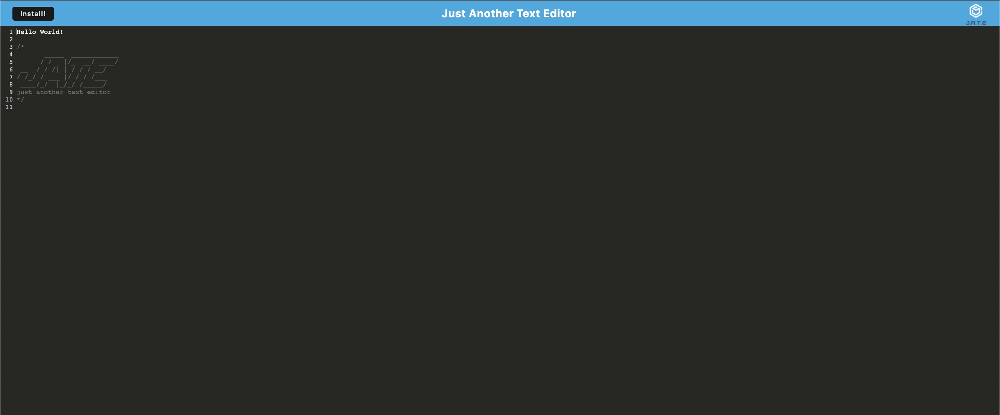

# m19c-PWA_Text_Editor
# The app is single-page application that meets PWA criteria
# 
# Date: 26/11/2022, 19:31:50 pm

Links:

[github repo url: https://github.com/PatrickARatcliff/m19c-PWA_Text_Editor](https://github.com/PatrickARatcliff/m19c-PWA_Text_Editor)

[heroku deployed url: https://m19c-pwa-text-editor.herokuapp.com/](https://m19c-pwa-text-editor.herokuapp.com/)

Screenshots:

## Table of Contents
- [Project Description](#project-description)
- [Installation Instructions](#installation-instructions)
- [Usage Information](#usage-information)
- [Contribution Guidelines](#contribution-guidelines)
- [Test Instructions](#test-instructions)
- [License](#license)
  
## Project Description
- A text editor that runs in the browser. The app will is single-page application that meets PWA criteria. Additionally, it features a number of data persistence techniques that serve as redundancy in case one of the options is not supported by the browser. The application also function offline.
  
## Installation Instructions
- To install, fork the repo, clone to your local repository. In your terminal/bash cd to the local repo and run the command: 

        npm i 

- Next, run the command: 

        npm run install 

- Next, run the command: 

        npm run build

- Next, run the command: 

        npm start

A window should automatically open in your browser displaying the app (if not, navigate to http://localhost:3000/).
  
## Usage Information
- To use the app, either deploy locally 

        http://localhost:3001/ 

-OR, in your browser, navigate to

        https://m19c-pwa-text-editor.herokuapp.com/

- If youi click the install button the upper-left corner of the page you should given a prompt to install the app. 

- Enter text in the editor and your changes wwill be saved locally (hile off-line) and in a database.
  
## Contribution Guidelines
- To contribute to this project, fork the repository at ‘https://github.com/PatrickARatcliff/m19c-PWA_Text_Editor' ,create a pull request with a description for the change and its location.
  
## Test Instructions
- N/A
    
## License
- MIT License
- m14c-MVC-tech_blog: CMS-style blog site similar to a Wordpress site, where developers can publish their blog posts and comment on other developers’ posts as well.
- Copyright (c) [2022] [Patrick Ratcliff]. All rights reserved.

    

      Permission is hereby granted, free of charge, to any person obtaining a copy
      of this software and associated documentation files (the "Software"), to deal
      in the Software without restriction, including without limitation the rights
      to use, copy, modify, merge, publish, distribute, sublicense, and/or sell
      copies of the Software, and to permit persons to whom the Software is
      furnished to do so, subject to the following conditions:

      The above copyright notice and this permission notice shall be included in all
      copies or substantial portions of the Software.

      THE SOFTWARE IS PROVIDED "AS IS", WITHOUT WARRANTY OF ANY KIND, EXPRESS OR
      IMPLIED, INCLUDING BUT NOT LIMITED TO THE WARRANTIES OF MERCHANTABILITY,
      FITNESS FOR A PARTICULAR PURPOSE AND NONINFRINGEMENT. IN NO EVENT SHALL THE
      AUTHORS OR COPYRIGHT HOLDERS BE LIABLE FOR ANY CLAIM, DAMAGES OR OTHER
      LIABILITY, WHETHER IN AN ACTION OF CONTRACT, TORT OR OTHERWISE, ARISING FROM,
      OUT OF OR IN CONNECTION WITH THE SOFTWARE OR THE USE OR OTHER DEALINGS IN THE
      SOFTWARE.

    
***[This is an external link to the MIT license](https://en.wikipedia.org/wiki/MIT_License)***
  
---
